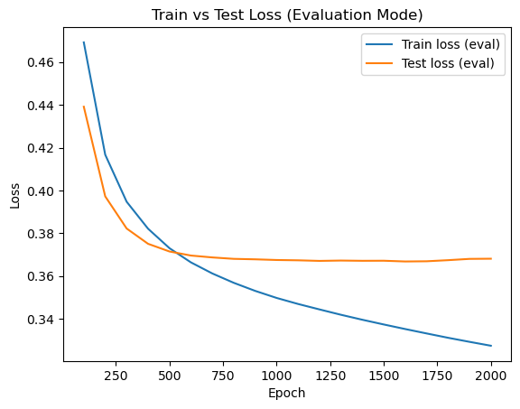
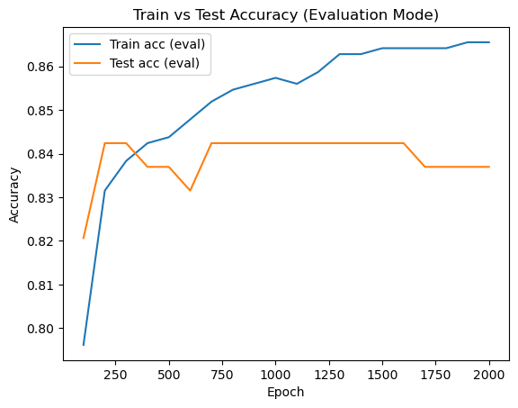
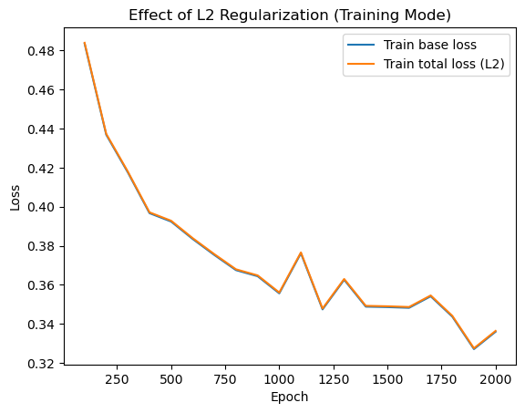
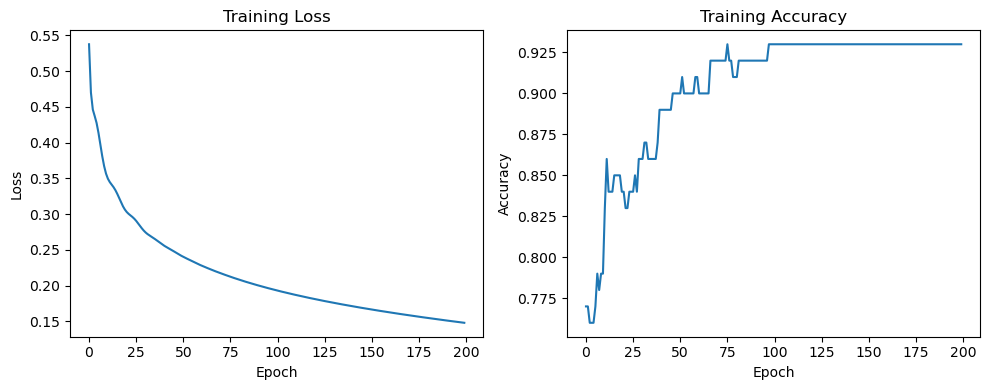
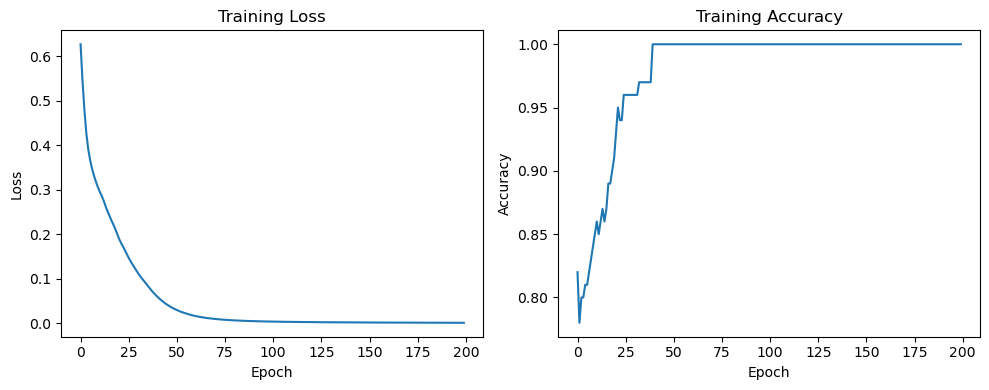

# Neural Network Learning
 
Two from-scratch/PyTorch neural network implementations, done as coursework for **INM702: Mathematics and Programming for AI** (MSc Artificial Intelligence, City St George's, University of London).
 
- **Task 1** — a multi-layer neural network built from scratch with NumPy only: no autodiff, no framework. Forward pass, backward pass, activation functions, dropout and regularisation are all hand-derived and hand-implemented.
- **Task 2** — the same kind of problem (binary classification), this time with PyTorch, to compare a hand-rolled implementation against a standard deep learning framework.
## Task 1 — NumPy neural network (`task1/`)
 
**Goal:** implement a multi-layer neural network for binary classification with nothing but NumPy — every forward/backward computation is manual.
 
**Dataset:** [UCI Heart Disease dataset](task1/heart_disease_uci.csv) — predicting presence of heart disease from patient clinical features (age, cholesterol, chest pain type, ECG results, etc.). Chosen over a toy dataset like MNIST/Iris because it's tabular, has missing values and mixed categorical/numeric features, which forces real preprocessing decisions rather than a clean, ready-to-train input.
 
**What's implemented, from scratch:**
- `sigmoid` / `sigmoid_derivative`, `relu` / `relu_derivative` — activation functions with their gradients
- `softmax` — numerically stable (max-subtraction trick to avoid overflow)
- `NeuralNet` class — a fully parametrisable feed-forward network:
  - configurable architecture (arbitrary hidden layer sizes)
  - **He initialisation** for ReLU layers
  - **inverted dropout** (forward and backward pass), so test-time forward pass needs no rescaling
  - **L2 regularisation** (weight decay) on the loss and its gradient
  - manual backpropagation deriving `dW`/`db` at every layer, propagating gradients back through dropout masks and ReLU derivatives
  - gradient-descent parameter updates
**Preprocessing:** missing-value imputation (mean), one-hot encoding of categorical features, train/test split stratified on the target, feature scaling fit on train only.
 
**Result:** with a single 32-unit hidden layer, dropout (`keep_prob=0.9`) and L2 regularisation (`λ=0.01`), trained for 2000 epochs: **~86% train accuracy, ~84% test accuracy** on held-out data, with train/test loss and accuracy curves logged and plotted every 100 epochs.
 
<p align="center">
  
  
</p>
<p align="center"><em>Train vs. test loss and accuracy over 2000 epochs (evaluation mode).</em></p>
<p align="center">
  
</p>
<p align="center"><em>Base loss vs. total loss (with L2 penalty added) during training — shows the regularisation term's contribution.</em></p>
**Run it:**
```bash
cd task1
pip install -r requirements.txt
jupyter notebook test.ipynb
```
 
## Task 2 — PyTorch comparison (`task2/`)
 
**Goal:** the same style of problem, now with a standard framework, to compare a hand-built model against PyTorch's autodiff and optimisers.
 
**Dataset:** [ECG200](task2/ECG200_TRAIN.txt) — a time-series dataset of single-heartbeat ECG readings (96 timesteps per sample), binary classification: normal vs. ischemic heartbeat.
 
**What's implemented:**
- `LogisticECG` — a single linear layer + sigmoid, as the baseline
- `MLPECG` — a 1-hidden-layer MLP (`Linear → ReLU → Linear → Sigmoid`), trained with `BCELoss` and the `Adam` optimiser
- Hyperparameter sweeps:
  - hidden layer width: 16 / 32 / 64 units
  - learning rate: 0.001 / 0.01 / 0.1
**Result:** best configuration was **hidden_dim=32, lr=0.01 → 89% test accuracy** (16 units: 85%, 64 units: 87%; lr=0.001: 86%, lr=0.1: 87%).
 
<p align="center">
  
  
</p>
<p align="center"><em>Left: logistic regression baseline (81% test accuracy). Right: MLP after adding a hidden layer — reaches 100% train accuracy (expected overfitting on a 100-sample training set) but generalises better, 89% test accuracy.</em></p>
**Run it:**
```bash
cd task2
pip install torch numpy
jupyter notebook ecg_project.ipynb
```
 
## Why this repo
 
Task 1 is the part worth looking at closely if you want to see the underlying math, not just an API call: every gradient (softmax + cross-entropy, ReLU backprop, inverted dropout, L2 weight decay) is derived and coded by hand, with no `autograd` involved.
 
